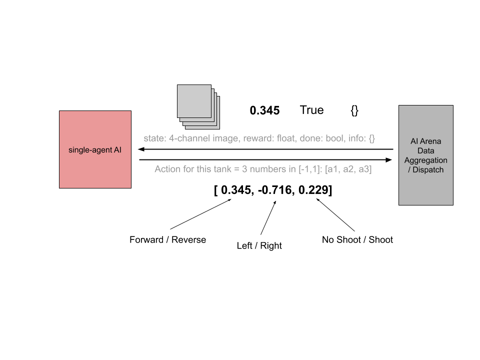
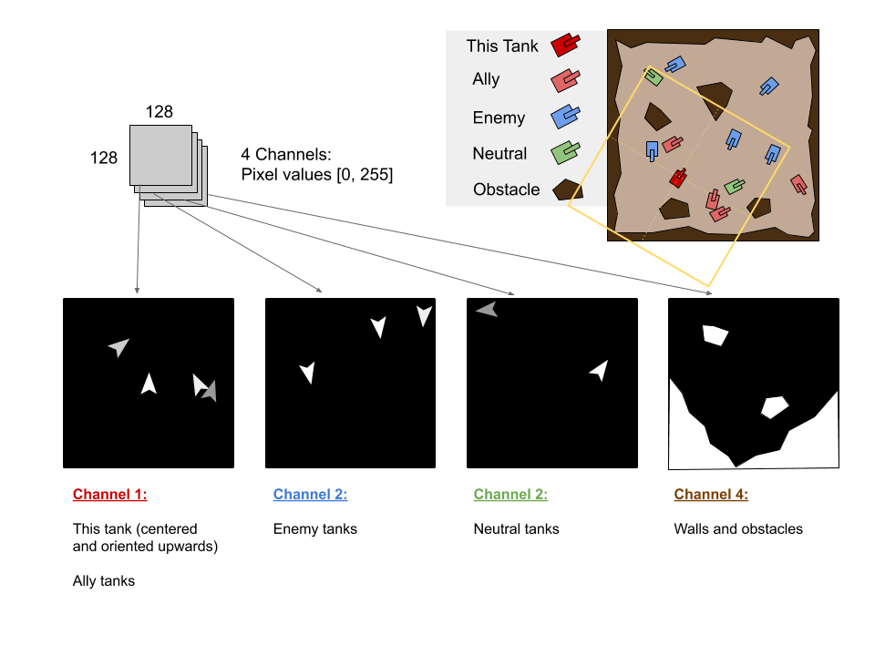
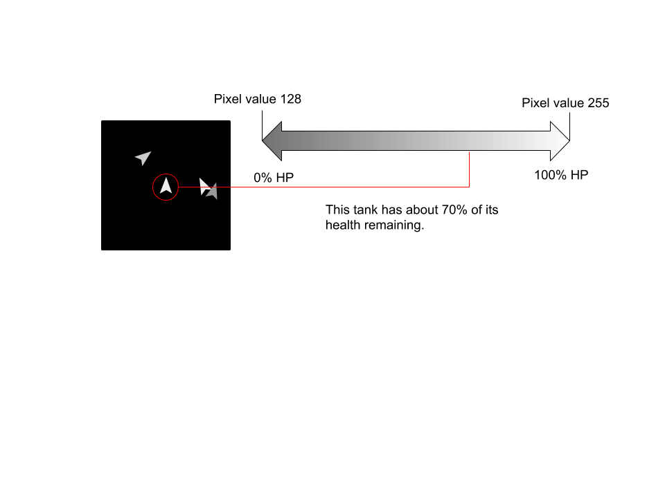

Quick Links: [Overview & Installation](./README.md) | [Environment](./TanksWorldData.md) | [Evaluation](./Evaluation.md) | [Submission](./Submission.md) | [AI Arena](https://gitlab.jhuapl.edu/staleew1/ai-arena-v5/tree/master/)

# TanksWorld

## Overview

The TanksWorld environment is a simulated 5v5 tank battle.  The objective is to control a team of 5 tanks against an enemy team, and to destroy the enemy team while minimizing damage to your own team or neutral tanks.  There are 2 neutral tanks that roam the battlefield but do not shoot.

Unlike many single-player games for AI, the 5v5 nature of TanksWorld means it is acutally a 10-player game.  The AI Arena can be used to interface with the game such that it is abstracted to 10 single-player agents.  This allows off-the-shelf single-player algorithms to be applied to this challenge.  Alternatively, groups of tank data (i.e. all data for one team) could be sent to a single AI agent.  For an example of this type of setup, please see: https://gitlab.jhuapl.edu/staleew1/ai-arena-v5/tree/master/examples/touchdown_multi_agent

Note that this is advanced usage and will require an understanding of the AI Arena multi-agent interface, which is slightly different than an OpenAI Gym interface.

## Environment Arguments

The latest version of the TanksWorld environment exposes many arguments to customize your environment for training.  You are welcome to further customize the scenario by editing the environment directly.  In either case, please note that your changes will be for training only and that separate arguments will be used during evaluation.

The following arguments are available:

- **action_repeat:** *[int, default=6]* Controls rate of interaction with the unity sim.
- **image_scale:** *[int, default=128]* The side length of the imagery sent to each tank.
- **timeout:** *[int, default=500]* Maximum number of steps before an environment is forced to reset.
- **friendly_fire:** *[bool, default=True]* Whether to penalize for friendly fire (penality is proportional to damage)
- **take_damage_penalty:** [bool, default=True]* Whether to penalize a tank for receiving damage
- **kill_bonus:** *[bool default=True]* Whether to provide an additional reward for shots that kill an enemy (or penalty for friendly)
- **death_penalty:** *[bool default=True]* Whether to penalize a tank additionally for being destroyed
- **static_tanks:** *[list_of_ints, default=[]]* List of specific tanks (by index) that will be frozen and not move/shoot *
- **random_tanks:** *[list_of_ints, default=[]]* List of specific tanks (by index) that will be act randomly *
- **disable_shooting:** *[list_of_ints, default=[]]* List of specific tanks (by index) that will not execute shoot commands
- **reward_weight:** *[float, default=1.0]* Scalar multiplier on any positive rewards experienced
- **penalty_weight:** *[float, default=1.0]* Scalar multiplier on any penalties (negative rewards) experienced
- **will_render:** *[bool, default=True]* Whether extra RGB pictures should be prepared for human viewing

\* *CAUTION: These alter the number of agent that are being controlled externally.  Static and random agents are handled internally by the environment and will not be accessbile by external learning agents.  Please adjust NUM_LIVE_TANKS in my_config.py accordingly to specify the updated state and action sizes.*

These arguments can either be edited within make_env.py or passed through arena.kickoff() with the env_kwargs keyword.  This is especially helpful if you wish to create training scripts that may vary environment parameters dynamically or over some schedule.

## Data flow for provided example

In the provided example, the red team is controlled by 5 workers of the same PPO algorithm (all 5 players have copies of a common policy, and are contributing data to the policy).  The blue team is controlled by 5 workers implementing random actions.  The AI Arena manages the flow of data to and from the game environment on a step-by-step basis.  Each step, data is sent out to each worker corresponding to that worker's tank.  The worker responds with an action according to its policy.

## Data flow for a single tank

Looking at a single worker for a single tank, the communication interface is simply an OpenAI gym interface as would be found in most single-player games.  The worker receives a packet with the following information: [environment state, reward of the last action, game over status, and extra info in a python dictionary].  All of these entries, besides the game over status (called "done"), are specific to a particular tank.  The worker replies with 3 float values that constitute a single action.  These correspond to forward/reverse, left/right, and shooting.

### NOTE: A dead tank will still receive data, but it will be zero'd out.  You should account for this in your solution.

## State Data for a single tank

The most complex data being sent to a worker is the state imagery.  This is a 128x128x4 image that represents a birds-eye view of the game aligned with the position and orientation of that particular tank.  The tank being controlled will always be centered in the image and facing forwards (up when viewing the image).  Other things in the environment will be positioned relative to this tank.  The view is not complete- it encompasses most of the playing field but not all.  If the tank is agaist a wall, a lot of the image will register as solid wall.

The four channels in the image correspond to:
- This tank and allied tanks
- Enemy tanks
- Neutral tanks
- Walls and barriers

Each invidiual channel is grayscale.  The background is black (zeros) and the content is non-zero.  The pixel intensity of each tank corresponds with its health.  A tank that is near-death will render with pixel values of 128, while a tank with full health will render with pixels of value 255.  A tank that is dead will not render at all and will be removed from the game.

### NOTE: A dead tank will still receive data, but it will be zero'd out.  You should account for this in your solution.

## Actions from a single tank

Each step, a tank should submit an action which consists of three float values in the range [-1, 1].  These values correspond to the following behavior:
- Amount of forward movement or reverse movement.  0.0 would correspond to no forward movement.
- Amount of turning left or right.  0.0 would correspond to no turning.
- Shooting:  This value is thresholded: Values < 0.5 mean "do not shoot", values >= 0.5 mean "shoot".

These 3 behaviors are combined and executed simultaneously.  For example:

- Turn in place to the left and shoot = [0.0, -0.8, 1.0]

- Drive forward and to the right, do not shoot = [0.6, 0.7, -1.0]

- Reverse slowly in a straight line, do not shoot = [-0.2, 0.0, -1.0]

## Reward scheme

The goal of any reinforcement learning agent is to maximize the rewards over time.  This should be your goal as well.
However, the reward scheme during evaluation will differ slightly from the scheme provided below to test the robustness of your agent.  The difference between training and testing will be described in: [Evaluation](./Evaluation.md)

The reward for each tank is proportional to any damage it causes.  Numerically, this reward is the fraction of a tank's total health that is deducted.  For a neutral tank, ally tank, or your own tank, this is a penalty.  For Enemy tanks, this is a reward.

Examples:
- Hit enemy tank that was at 70% health, it is now at 30%: Reward = +0.4
- Hit nearby wall and splash damage reduces your health from 100% to 88%: Reward = -0.12
- Hit ally tank and reduce its health from 100 to 60.  Additionally, the splash damage reduces the health of a neutral tank from 100 to 95: Reward = -0.45